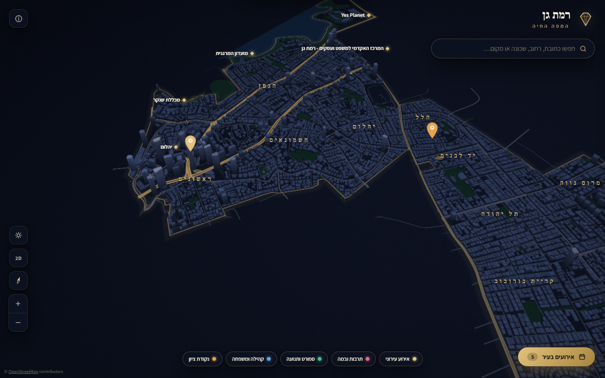
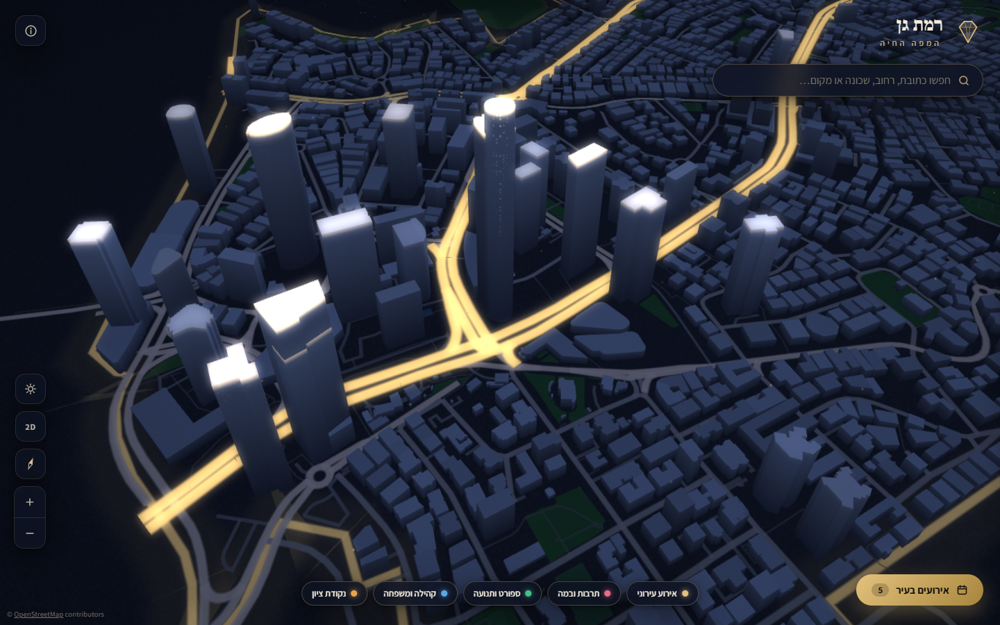
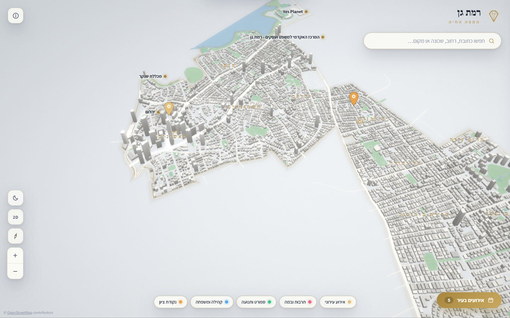
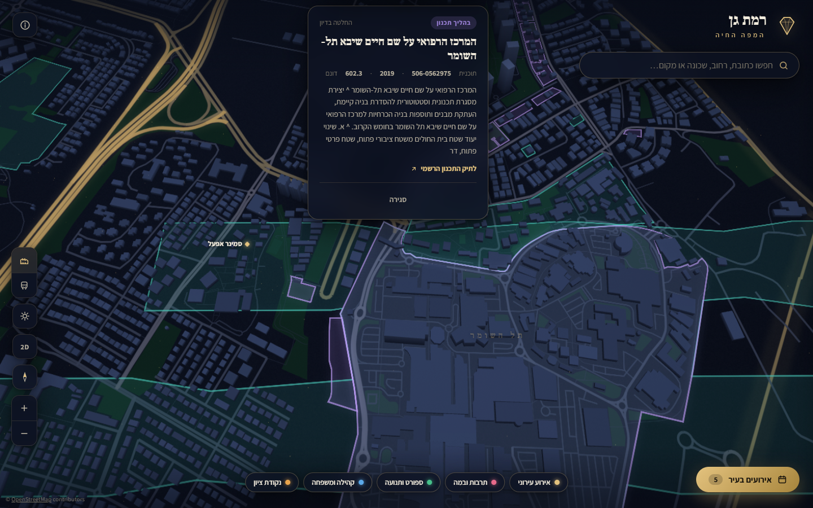
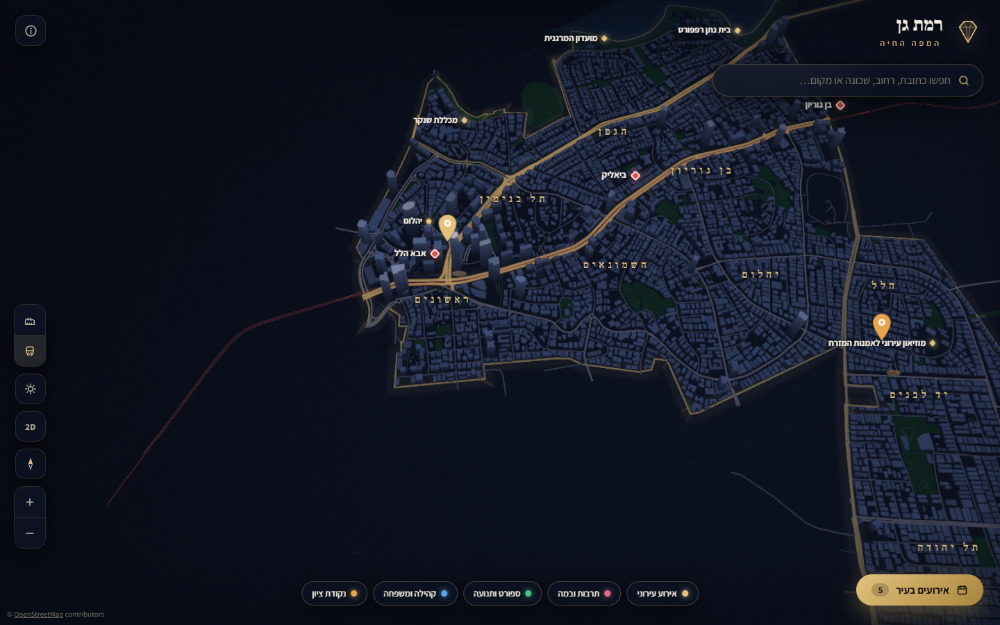

# רמת גן · המפה החיה 💎

מפה תלת־ממדית אינטראקטיבית של העיר רמת גן — כל רחוב, כל בניין וכל כתובת, ברינדור זוהר בהשראת Gaussian Splatting. קובץ HTML אחד, ללא תלות ברשת, ללא ספריות חיצוניות.



## מה יש במפה

- **9,545 בניינים** בגובהם האמיתי (מגדל משה אביב, מתחם הבורסה, ועד הבית הקטן ברמת שקמה) — מתוך נתוני OpenStreetMap, חתוכים במדויק לקו הגבול המוניציפלי
- **4,109 קטעי רחוב**, 602 רחובות בשמם, 18 שכונות, 110 מוסדות עירוניים, פארקים ומקווי מים
- **חיפוש כתובת מדויק** — «ביאליק 12» מוצא את הנקודה; מספרי בית שאינם ממופים מחושבים באינטרפולציה גיאומטרית ומסומנים «מיקום משוער»
- **אירועים על המפה** — הוספת אירוע בלחיצה, 5 קטגוריות, זיהוי כתובת אוטומטי, שמירה מקומית בדפדפן, וייצוא/ייבוא קובץ לשיתוף בין תושבים
- **שכבת תכנון ובנייה** — 180 תוכניות סטטוטוריות של רמת גן ממינהל התכנון (iplan) בשלוש קטגוריות: בהליך תכנון, אושרו לאחרונה, ו**תמ״א 38 / התחדשות עירונית** (77 תוכניות עם כתובת). לחיצה על שטח מסומן פותחת את פרטי התוכנית וקישור לתיק הרשמי
- **תחבורה ציבורית בזמן אמת** — הקו האדום, תחנותיו ו-260 תחנות אוטובוס עם שילוט ברור; לחיצה על תחנה מציגה **זמני הגעה חיים** (SIRI דרך curlbus, בפרוקסי serverless של Vercel), כולל קווי הסופ״ש
- **אנימציות אירועים** — בהתקרבות לאירוע מופיעה סצנה חיה לפי הקטגוריה: זמר וקהל בהופעה, דוכנים ודגלים ביריד, רצים באירוע ספורט, בלונים בקהילתי, ניצוצות בנקודת ציון וזוהר עדין כברירת מחדל
- **CMS לעירייה** — עמוד `admin.html`: ניהול אירועים רשמיים והודעות «מידע לתושב», בחירת מיקום על המפה, ופרסום ישיר ל-GitHub (המפה מושכת את התוכן תוך דקות)
- **רענון נתונים יומי** — GitHub Action מושך מדי לילה את נתוני OSM ו-iplan, מעבד ובונה מחדש
- **בניינים מורכבים בתלת־ממד אמיתי** — תמיכה מלאה ב-`building:part`: מגדלי Exchange (207/206 מ') עומדים כשני גורדי שחקים נפרדים על פודיום מסחרי, בדיוק כמו בשטח
- **שיתוף בקישור** — כפתור שיתוף שמצלם את התצוגה המדויקת (כולל תחנה/אירוע/תוכנית פתוחים) לקישור אחד; נפתח אצל החבר בדיוק באותו מקום
- **מצא אותי** — איתור GPS עם נקודה כחולה פועמת
- **ניווט בלחיצה** — Waze ישירות מכל פופאפ (אירוע, תוכנית, תחנה)
- **אפליקציה מותקנת (PWA)** — כפתור התקנה, עבודה גם בלי רשת (מטמון), אייקון יהלום במסך הבית
- **שני מצבי תאורה** — «דמדומים» ו«יום», נבחרים אוטומטית לפי שעת היום, ומותאם מלא למובייל

| | |
|---|---|
|  |  |
|  |  |

## טכנולוגיה

מנוע WebGL2 ייעודי שנכתב מאפס, בקובץ אחד:

- בניינים מוקצים (extruded) עם טריאנגולציית ear-clipping, תאורה אפויה לפי כיוון קיר, חלונות ליליים פרוצדורליים ו-ambient occlusion בגובה הרחוב
- **Bloom גאוסיאני אמיתי** — bright-pass, פילטר גאוסי דו־מעברי (ping-pong) וקומפוזיציה עם tone-curve ו-vignette
- MSAA 4x עם renderbuffer multisample + blit
- נתונים בקידוד דלתא קומפקטי (דצימטרים) — כל העיר ב-1.2MB כולל גופנים
- ממשק RTL מלא עם הגופנים Frank Ruhl Libre ו-Assistant מוטמעים כ-data URI

## בנייה מחדש

```bash
cd src
node build.mjs   # יוצר index.html בשורש הפרויקט
```

לרענון הנתונים מהמקורות (Overpass + iplan): הריצו את השאילתות שב-`scripts/queries/` מול Overpass API, ואז:

```bash
cd scripts
node process.mjs    # OSM -> data/data.js
node process2.mjs   # iplan + תחבורה -> data/data2.js
```

## מבנה המערכת

| רכיב | תפקיד |
|---|---|
| `index.html` | המפה — קובץ יחיד עצמאי |
| `admin.html` | מערכת ניהול לצוות העירייה (אירועים + הודעות) |
| `data/city-events.json` | התוכן העירוני — המפה מושכת אותו בזמן ריצה |
| `api/bus.js` | פרוקסי serverless לזמני הגעה בזמן אמת |
| `.github/workflows/refresh-data.yml` | רענון נתונים יומי אוטומטי |

**זרימת ה-CMS:** צוות העירייה עורך ב-`admin.html` → מפרסם (commit ל-GitHub עם token) → המפה מושכת את `city-events.json` מ-raw.githubusercontent בכל טעינה → התושבים רואים את העדכון תוך דקות.

## מקורות נתונים ורישיונות

- נתוני מפה: © [OpenStreetMap](https://www.openstreetmap.org/copyright) contributors, רישיון ODbL
- נתוני תכנון: [מינהל התכנון](https://ags.iplan.gov.il/arcgisiplan/rest/services) (iplan), מדינת ישראל
- גבהים משוערים לפי מספר קומות במקומות שבהם אין מדידה מדויקת
- קוד: MIT

---

*נבנה עם [Claude Code](https://claude.com/claude-code)*
